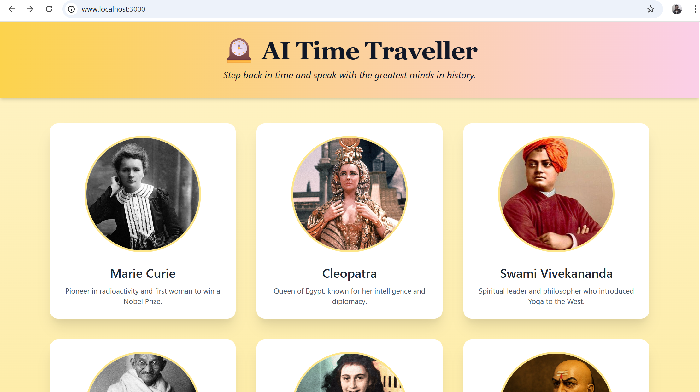
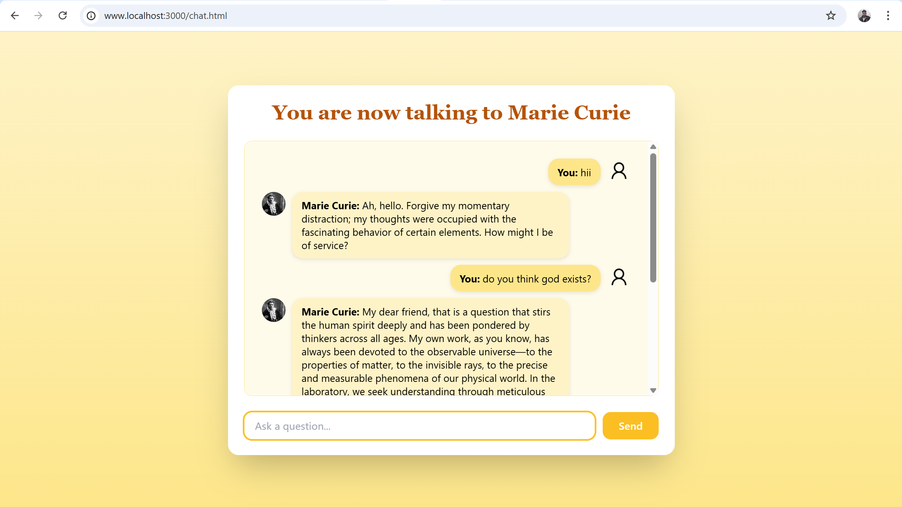

# 🕰️ AI Time Traveller

Talk to the greatest minds in history — from Einstein to Cleopatra — using the power of Generative AI.  
This web-based app lets you have intelligent conversations with 9 iconic historical and mythological characters.

---

## 🚀 Demo

- **Live Demo:** [https://ai-time-traveller.onrender.com/]
- **Local Demo:** Hosted on `localhost:3000` (after running backend)

### 📸 Screenshots

#### Homepage




#### Chat with Historical Figure




---

## ✨ Features

- 💬 Chat with famous figures like Gandhi, Marie Curie, Vivekananda, and Anne Frank.
- 🧠 Character-specific responses using Google Gemini API.
- ⚡ Powered by Gemini 2.5 Flash for fast, smart answers.
- 🎨 Clean frontend using HTML, CSS, and JavaScript.
- 📦 Backend using Node.js + Express.js

---

## 🗂️ Folder Structure

```
AI-Time-Traveller/
├── backend/             # Node.js + Gemini API backend
│   ├── index.js
├── public/              # Frontend files
│   ├── index.html
│   ├── chat.html
│   ├── style.css
│   ├── script.js
│   ├── images/          # Demo screenshots and assets
|── .env                # Your Gemini API key here
├── package.json
└── README.md
```

---

## 🛠️ Tech Stack

- **Frontend:** HTML, CSS, JavaScript, Tailwind CSS
- **Backend:** Node.js, Express.js
- **AI API:** Google Gemini (`@google/genai`)
- **Other Tools:** dotenv, cors, nodemon

---

## 🧠 Characters Included

| Name                | Role / Style                                      |
|---------------------|---------------------------------------------------|  
| Marie Curie         | Calm, intelligent scientist                       |
| Cleopatra           | Regal, persuasive, intelligent                    |
| Swami Vivekananda   | Deep, spiritual, thought-provoking                |
| Mahatma Gandhi      | Wise, peaceful, nonviolent leader                 |
| Anne Frank          | Hopeful, reflective, youthful                     |
| Chanakya            | Strategic, political, wise                        |
| Lenardo Da Vincci   | Polymath, Artist, Passionate                      |
| Stephen Hawking     | Humble, futuristic, clear                         |

---

## 🔑 Setup Instructions

### 1. Clone this repo

```bash
git clone https://github.com/ayushcodes3004/Persona-Based-Conversational-AI-Application
cd ai-time-traveller
```

### 2. Install backend dependencies

```bash
npm install
```

### 3. Add your `.env` file inside the `/backend` folder

```
GEMINI_API_KEY=your_google_gemini_api_key
```

> Get your key from: https://aistudio.google.com/app/apikey

### 4. Run the project

```bash
nodemon backend/index.js
```

Then open [http://localhost:3000](http://localhost:3000) in your browser.

---

## ⚠️ Troubleshooting

- Make sure your API key is valid and free quota is available.
- `.env` must be in `/backend`, not root.
- If `require` gives errors, remove `"type": "module"` from `package.json`.

---

## 💡 Inspiration

Inspired by the idea ofinterest in history and AI — to reimagine how we learn from the past.

---

## 📜 License

MIT — Use it, build on it, remix it.

---

## ✍️ Created by

**Ayush Jaiswal** — [LinkedIn](https://www.linkedin.com/in/ayushcodes3004)
